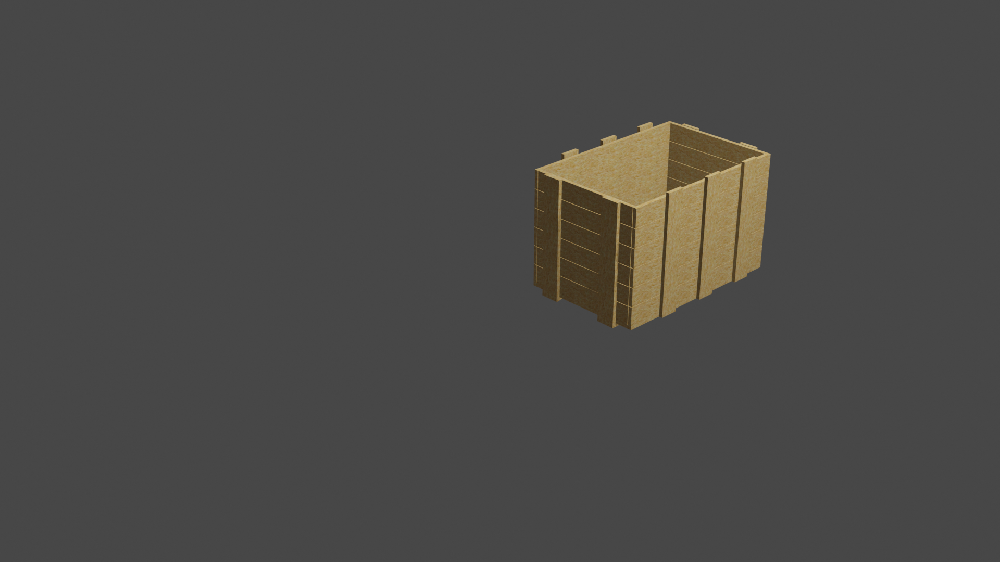
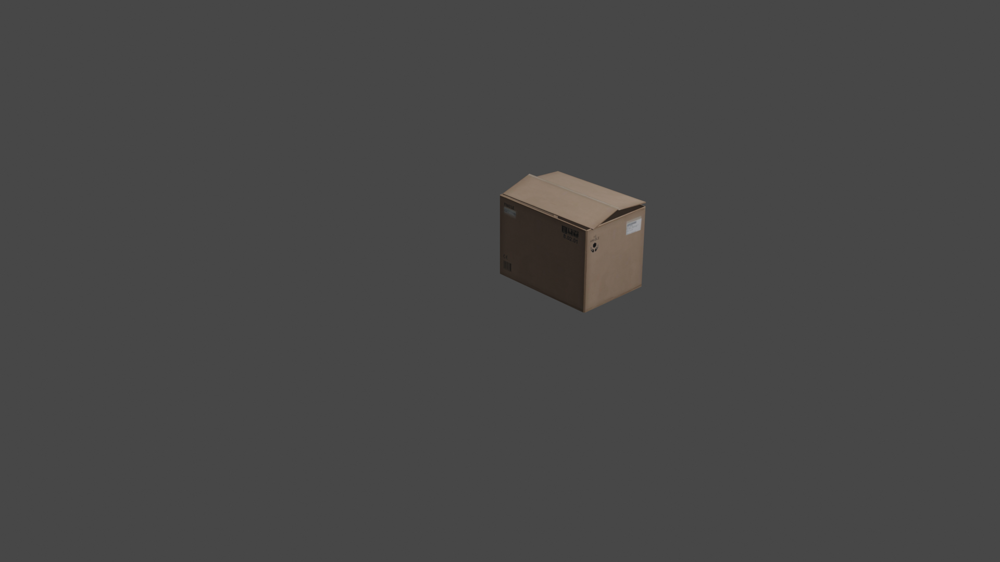
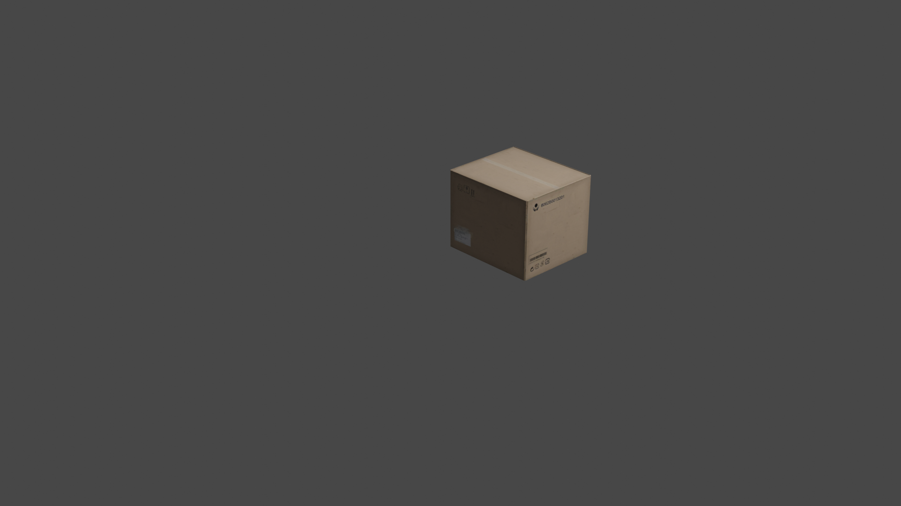
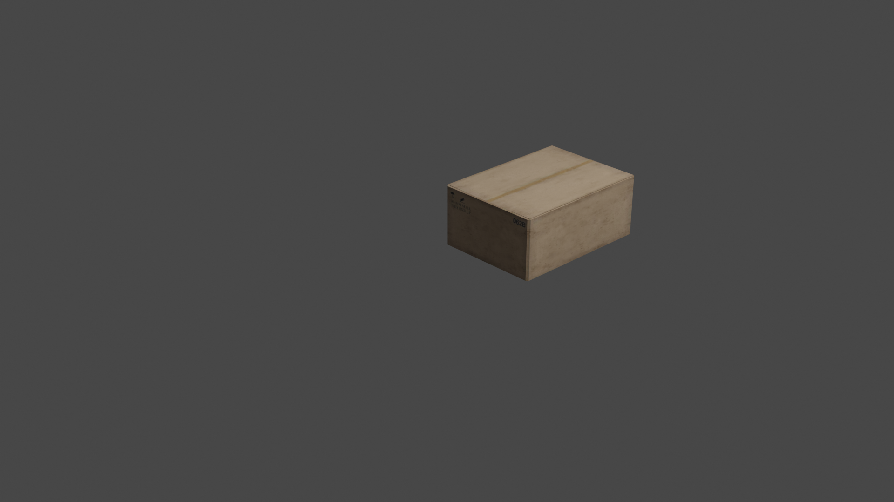
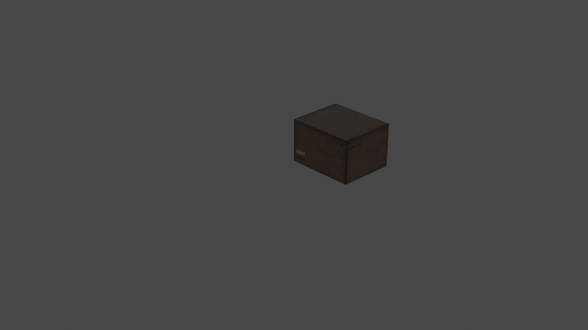
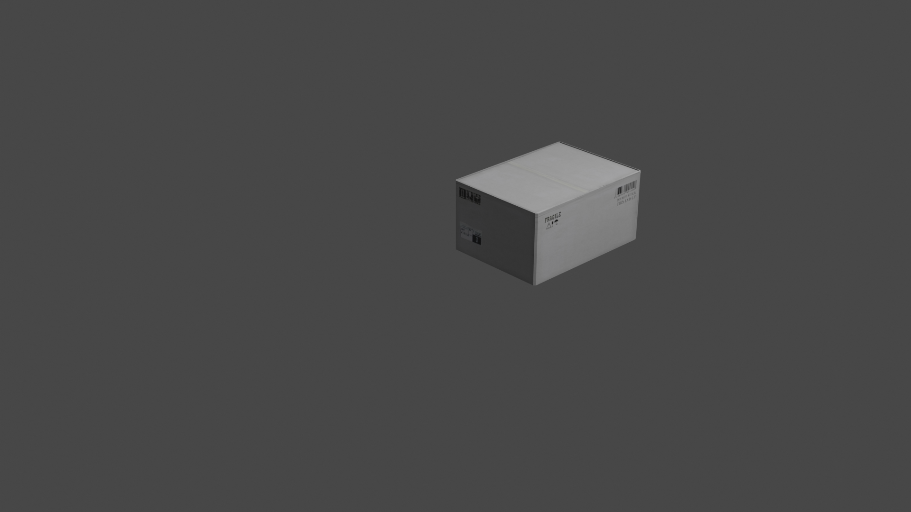
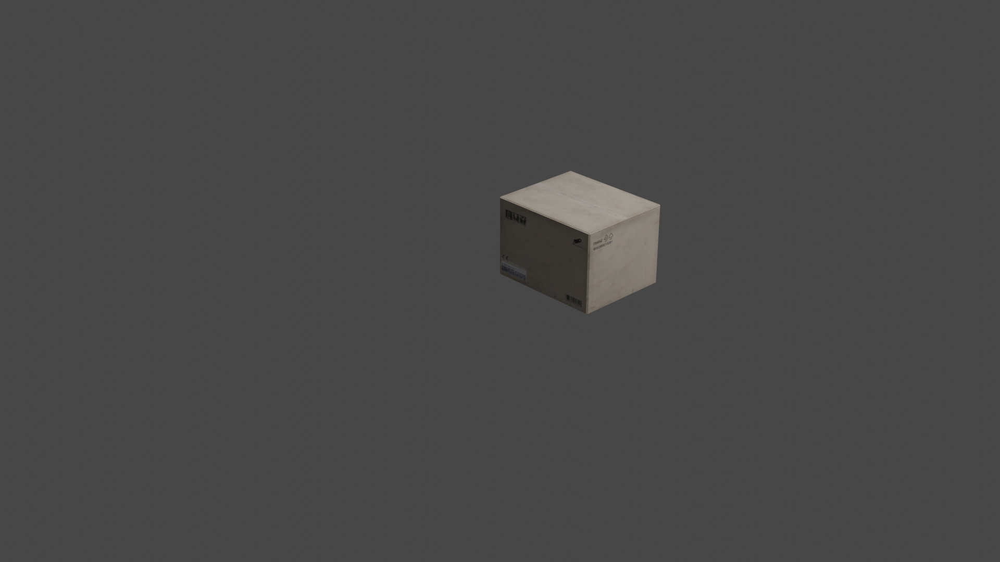
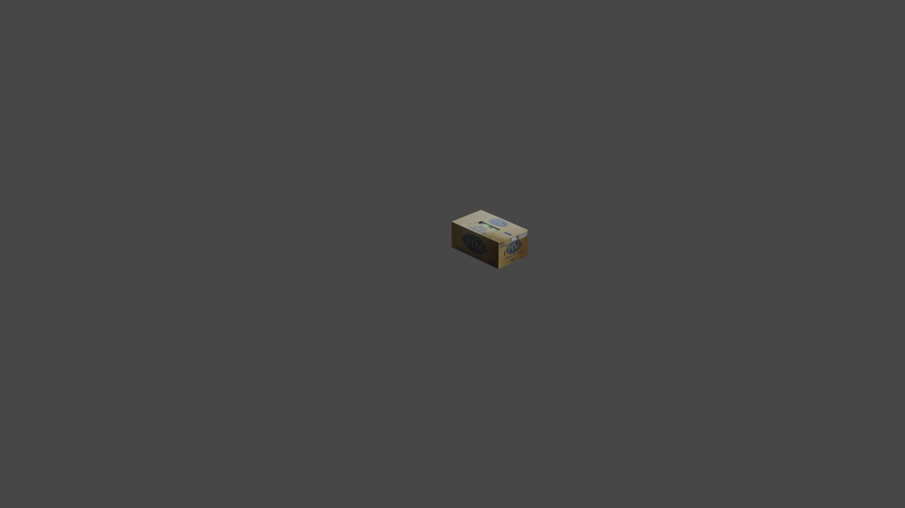

# 3D_Models_warehouse

This repo contains the 3D models for the Building a warehouse. Following are some of the 2D images of the models

# This Folder Contains all the model we have avilable for Boxes, and Small items which can be places on the racks.
And the List of Attached Pictures along with Links and Model Number.

| S. No  | Picture |Link|
| ------------- | ------------- |----|
| 1.  |   |<a href="https://github.com/AnuragSahu/3D_Models_warehouse/tree/master/BoxModels/model1"> Link </a>|
| 2.  |   |<a href="https://github.com/AnuragSahu/3D_Models_warehouse/tree/master/BoxModels/model2"> Link </a>|
| 3.  |   |<a href="https://github.com/AnuragSahu/3D_Models_warehouse/tree/master/BoxModels/model3"> Link </a>|
| 4.  |   |<a href="https://github.com/AnuragSahu/3D_Models_warehouse/tree/master/BoxModels/model4"> Link </a>|
| 5.  |   |<a href="https://github.com/AnuragSahu/3D_Models_warehouse/tree/master/BoxModels/model5"> Link </a>|
| 6.  |   |<a href="https://github.com/AnuragSahu/3D_Models_warehouse/tree/master/BoxModels/model6"> Link </a>|
| 7.  |   |<a href="https://github.com/AnuragSahu/3D_Models_warehouse/tree/master/BoxModels/model7"> Link </a>|
| 8.  |   |<a href="https://github.com/AnuragSahu/3D_Models_warehouse/tree/master/BoxModels/model8"> Link </a>|
