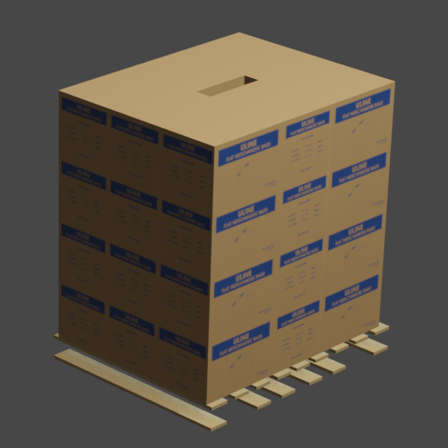
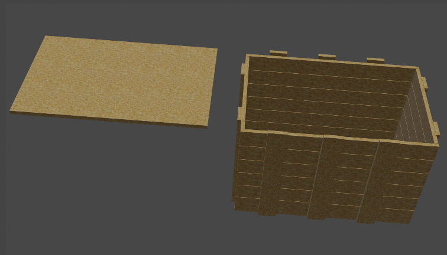
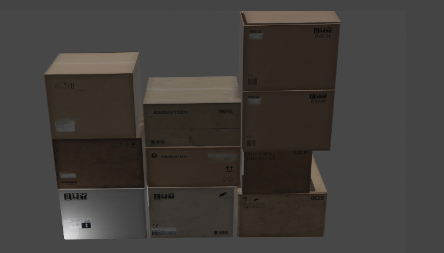
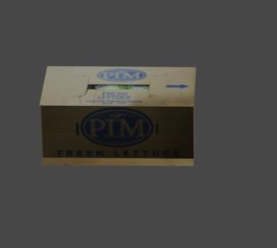
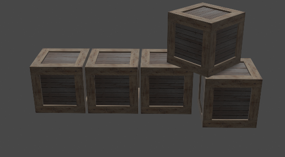
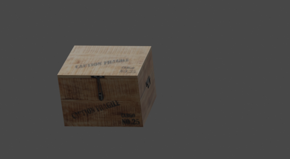
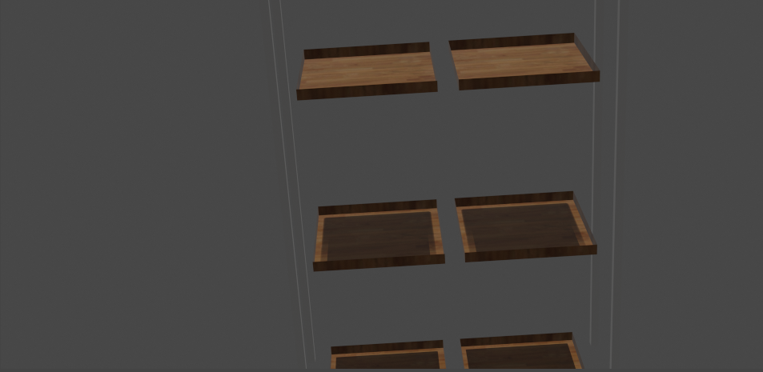

# 3D_Models_warehouse

This repo contains the 3D models for the Building a warehouse. Following are some of the 2D images of the models

Category 1

| S. No  | Picture |Link|
| ------------- | ------------- |----|
| 1.  |   |<a href="https://github.com/AnuragSahu/3D_Models_warehouse/tree/master/BoxModels/model1"> Link </a>|
| 2.  |   |<a href="https://github.com/AnuragSahu/3D_Models_warehouse/tree/master/BoxModels/model2"> Link </a>|
| 3.  |   |<a href="https://github.com/AnuragSahu/3D_Models_warehouse/tree/master/BoxModels/model3"> Link </a>|
| 4.  |   |<a href="https://github.com/AnuragSahu/3D_Models_warehouse/tree/master/BoxModels/model4"> Link </a>|
| 5.  |   |<a href="https://github.com/AnuragSahu/3D_Models_warehouse/tree/master/BoxModels/model5"> Link </a>|
| 6.  |   |<a href="https://github.com/AnuragSahu/3D_Models_warehouse/tree/master/BoxModels/model6"> Link </a>|
| 7.  |   |<a href="https://github.com/AnuragSahu/3D_Models_warehouse/tree/master/BoxModels/model7"> Link </a>|
| 8.  |   |<a href="https://github.com/AnuragSahu/3D_Models_warehouse/tree/master/BoxModels/model8"> Link </a>|
